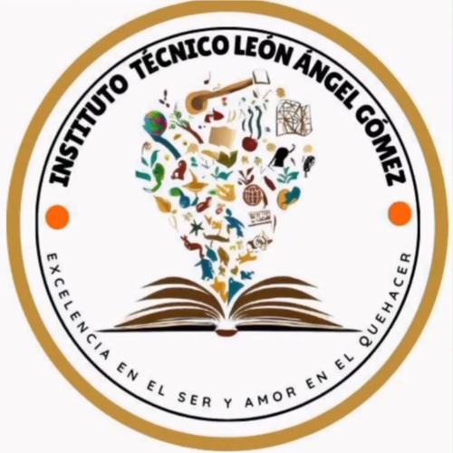

# Instituto Técnico León Ángel Gómez — Código completo del sitio

Este documento contiene el código de **todas** las páginas del sitio, listo para copiar y pegar en Visual Studio Code.

## Cómo usarlo

1. En VS Code, crea una carpeta nueva (por ejemplo `itlag-web`) y ábrela con **Archivo → Abrir carpeta**.

2. Por cada archivo listado abajo, crea un archivo nuevo con **exactamente ese nombre** dentro de esa carpeta y pega el código correspondiente.

3. El único archivo que NO está aquí (porque es una imagen, no texto) es `logo.png` — descárgalo aparte y ponlo en la misma carpeta, junto a los demás.

4. Al final debes tener 9 archivos en una sola carpeta: los 6 `.html`, `style.css`, `script.js` y `logo.png`.


---


## 📄 `index.html`

```html
<!DOCTYPE html>
<html lang="es">
<head>
<meta charset="UTF-8">
<script>document.documentElement.classList.add("js");</script>
<meta name="viewport" content="width=device-width, initial-scale=1.0">
<title>Instituto Técnico León Ángel Gómez — Conoce, elige y aprende</title>
<meta name="description" content="Sitio del Instituto Técnico León Ángel Gómez: conoce nuestras técnicas, descubre tus intereses y encuentra el área que más conecta contigo.">
<link rel="icon" href="logo.png" type="image/png">
<link rel="preconnect" href="https://fonts.googleapis.com">
<link rel="preconnect" href="https://fonts.gstatic.com" crossorigin>
<link href="https://fonts.googleapis.com/css2?family=Fraunces:ital,opsz,wght@0,9..144,500;0,9..144,600;1,9..144,500&family=Work+Sans:wght@400;500;600&display=swap" rel="stylesheet">
<link rel="stylesheet" href="style.css">
</head>
<body>

<header class="nav">
  <div class="nav-interna">
    <a href="index.html" class="nav-marca">
      
      <span class="nav-marca-texto"><strong>ITLAG</strong><span>León Ángel Gómez</span></span>
    </a>
    <nav class="nav-links" aria-label="Navegación principal">
      <a href="index.html">Inicio</a>
      <a href="conocenos.html">Conócenos</a>
      <a href="tecnicas.html">Técnicas</a>
      <a href="intereses.html">Descubre tus intereses</a>
      <a href="contacto.html">Contacto</a>
    </nav>
    <a href="tecnicas.html" class="boton boton-primario nav-cta">Explorar</a>
    <button class="nav-hamb" aria-label="Abrir menú" aria-expanded="false">
      <span></span><span></span><span></span>
    </button>
  </div>
  <div class="nav-movil">
    <a href="index.html">Inicio</a>
    <a href="conocenos.html">Conócenos</a>
    <a href="tecnicas.html">Técnicas</a>
    <a href="intereses.html">Descubre tus intereses</a>
    <a href="contacto.html">Contacto</a>
  </div>
</header>

<main>
  <!-- ===== HERO ===== -->
  <section class="hero">
    <div class="contenedor hero-grid">
      <div>
        <p class="hero-eyebrow">Bienvenido al</p>
        <h1>Instituto Técnico<br>León Ángel Gómez</h1>
        <p class="lema">"Conoce, elige y aprende"</p>
        <p class="desc">Explora nuestras técnicas, descubre nuevas habilidades y encuentra el área que más conecta con tus intereses.</p>
        <div class="hero-acciones">
          <a href="tecnicas.html" class="boton boton-primario">Explorar técnicas <span class="flecha">→</span></a>
          <a href="contacto.html" class="boton boton-secundario">Contáctanos</a>
        </div>
        <p class="hero-frase">Tu futuro también comienza con una elección.</p>
      </div>

      <div class="hero-visual">
        <svg class="doodle" style="top:-6px; left:6%; width:34px;" viewBox="0 0 40 40" fill="none">
          <path d="M4 30C10 14 22 6 36 6" stroke="#73785A" stroke-width="2" stroke-linecap="round"/>
          <path d="M36 6L30 4M36 6L33 12" stroke="#73785A" stroke-width="2" stroke-linecap="round"/>
        </svg>
        <svg class="doodle" style="bottom:0; right:2%; width:26px;" viewBox="0 0 30 30" fill="none">
          <circle cx="15" cy="15" r="3" fill="#D27B52"/>
          <circle cx="4" cy="15" r="2" fill="#B96648"/>
          <circle cx="26" cy="15" r="2" fill="#B96648"/>
        </svg>
        <div class="hero-visual-marco">
          
        </div>
      </div>
    </div>
  </section>

  <!-- ===== QUÉ PUEDES HACER AQUÍ ===== -->
  <section class="franja-que franja--alt revelar">
    <div class="contenedor">
      <div class="encabezado-seccion">
        <h2>¿Qué puedes hacer aquí?</h2>
      </div>
      <div class="tres-cols">
        <article>
          <span class="num">01</span>
          <h3>Conocer</h3>
          <p>Conoce nuestro Instituto.</p>
        </article>
        <article>
          <span class="num">02</span>
          <h3>Explorar</h3>
          <p>Descubre nuestras técnicas.</p>
        </article>
        <article>
          <span class="num">03</span>
          <h3>Descubrir</h3>
          <p>Conoce tus intereses.</p>
        </article>
      </div>
    </div>
  </section>
</main>

<footer class="pie">
  <div class="contenedor">
    <div class="pie-top">
      <div class="pie-marca">
        
        <div>
          <strong>INSTITUTO TÉCNICO LEÓN ÁNGEL GÓMEZ</strong>
          <small>Excelencia en el ser y amor en el quehacer</small>
        </div>
      </div>
      <div class="pie-links">
        <div class="pie-col">
          <h4>Navegación</h4>
          <a href="index.html">Inicio</a>
          <a href="conocenos.html">Conócenos</a>
          <a href="tecnicas.html">Técnicas</a>
        </div>
        <div class="pie-col">
          <h4>Descubre</h4>
          <a href="intereses.html">Descubre tus intereses</a>
          <a href="contacto.html">Contacto</a>
        </div>
      </div>
    </div>
    <p class="pie-bottom">Proyecto estudiantil — Instituto Técnico León Ángel Gómez.</p>
  </div>
</footer>

<script src="script.js"></script>
</body>
</html>

```


## 📄 `conocenos.html`

```html
<!DOCTYPE html>
<html lang="es">
<head>
<meta charset="UTF-8">
<script>document.documentElement.classList.add("js");</script>
<meta name="viewport" content="width=device-width, initial-scale=1.0">
<title>Conócenos — Instituto Técnico León Ángel Gómez</title>
<link rel="icon" href="logo.png" type="image/png">
<link rel="preconnect" href="https://fonts.googleapis.com">
<link rel="preconnect" href="https://fonts.gstatic.com" crossorigin>
<link href="https://fonts.googleapis.com/css2?family=Fraunces:ital,opsz,wght@0,9..144,500;0,9..144,600;1,9..144,500&family=Work+Sans:wght@400;500;600&display=swap" rel="stylesheet">
<link rel="stylesheet" href="style.css">
</head>
<body>

<header class="nav">
  <div class="nav-interna">
    <a href="index.html" class="nav-marca">
      
      <span class="nav-marca-texto"><strong>ITLAG</strong><span>León Ángel Gómez</span></span>
    </a>
    <nav class="nav-links" aria-label="Navegación principal">
      <a href="index.html">Inicio</a>
      <a href="conocenos.html">Conócenos</a>
      <a href="tecnicas.html">Técnicas</a>
      <a href="intereses.html">Descubre tus intereses</a>
      <a href="contacto.html">Contacto</a>
    </nav>
    <a href="tecnicas.html" class="boton boton-primario nav-cta">Explorar</a>
    <button class="nav-hamb" aria-label="Abrir menú" aria-expanded="false">
      <span></span><span></span><span></span>
    </button>
  </div>
  <div class="nav-movil">
    <a href="index.html">Inicio</a>
    <a href="conocenos.html">Conócenos</a>
    <a href="tecnicas.html">Técnicas</a>
    <a href="intereses.html">Descubre tus intereses</a>
    <a href="contacto.html">Contacto</a>
  </div>
</header>

<main>
  <section class="encabezado-pagina">
    <div class="contenedor">
      <h1>Conócenos</h1>
      <p class="subtitulo">Más que aprender una técnica, se trata de descubrir lo que puedes hacer con ella.</p>
    </div>
  </section>

  <section class="franja--sm revelar">
    <div class="contenedor">
      <div class="bloque-texto">
        <h2>Quiénes somos</h2>
        <p>El Instituto Técnico León Ángel Gómez busca brindar formación técnica y contribuir al desarrollo integral de sus estudiantes.</p>
      </div>
    </div>
  </section>

  <section class="franja--sm franja--alt revelar">
    <div class="contenedor">
      <div class="encabezado-seccion">
        <h2>Lo que nos guía</h2>
      </div>
      <div class="valores">
        <div class="valor">
          <svg viewBox="0 0 24 24" fill="none" stroke-width="1.6" stroke-linecap="round" stroke-linejoin="round"><path d="M4 19.5V6a2 2 0 0 1 2-2h11a1 1 0 0 1 1 1v14"/><path d="M4 19.5A2.5 2.5 0 0 1 6.5 17H18"/></svg>
          <h3>Formación</h3>
          <p>Procesos de aprendizaje orientados a desarrollar conocimientos y habilidades técnicas.</p>
        </div>
        <div class="valor">
          <svg viewBox="0 0 24 24" fill="none" stroke-width="1.6" stroke-linecap="round" stroke-linejoin="round"><path d="M12 2l2.6 5.9 6.4.6-4.8 4.3 1.4 6.3L12 16l-5.6 3 1.4-6.3-4.8-4.3 6.4-.6z"/></svg>
          <h3>Excelencia</h3>
          <p>El compromiso con hacer bien las cosas, presente en cada espacio del Instituto.</p>
        </div>
        <div class="valor">
          <svg viewBox="0 0 24 24" fill="none" stroke-width="1.6" stroke-linecap="round" stroke-linejoin="round"><path d="M20.8 4.6a5 5 0 0 0-7.1 0L12 6.3l-1.7-1.7a5 5 0 1 0-7.1 7.1L12 20.3l8.8-8.6a5 5 0 0 0 0-7.1z"/></svg>
          <h3>Compromiso</h3>
          <p>Amor en el quehacer diario, dentro y fuera del aula de clase.</p>
        </div>
      </div>
    </div>
  </section>

  <section class="franja--sm revelar">
    <div class="contenedor">
      <div class="bloque-texto">
        <h2>¿Por qué una formación técnica?</h2>
        <p>Una formación técnica permite desarrollar conocimientos, habilidades y competencias relacionadas con diferentes áreas de formación, preparando a los estudiantes para nuevos retos.</p>
      </div>
    </div>
  </section>
</main>

<footer class="pie">
  <div class="contenedor">
    <div class="pie-top">
      <div class="pie-marca">
        
        <div>
          <strong>INSTITUTO TÉCNICO LEÓN ÁNGEL GÓMEZ</strong>
          <small>Excelencia en el ser y amor en el quehacer</small>
        </div>
      </div>
      <div class="pie-links">
        <div class="pie-col">
          <h4>Navegación</h4>
          <a href="index.html">Inicio</a>
          <a href="conocenos.html">Conócenos</a>
          <a href="tecnicas.html">Técnicas</a>
        </div>
        <div class="pie-col">
          <h4>Descubre</h4>
          <a href="intereses.html">Descubre tus intereses</a>
          <a href="contacto.html">Contacto</a>
        </div>
      </div>
    </div>
    <p class="pie-bottom">Proyecto estudiantil — Instituto Técnico León Ángel Gómez.</p>
  </div>
</footer>

<script src="script.js"></script>
</body>
</html>

```


## 📄 `tecnicas.html`

```html
<!DOCTYPE html>
<html lang="es">
<head>
<meta charset="UTF-8">
<script>document.documentElement.classList.add("js");</script>
<meta name="viewport" content="width=device-width, initial-scale=1.0">
<title>Técnicas — Instituto Técnico León Ángel Gómez</title>
<link rel="icon" href="logo.png" type="image/png">
<link rel="preconnect" href="https://fonts.googleapis.com">
<link rel="preconnect" href="https://fonts.gstatic.com" crossorigin>
<link href="https://fonts.googleapis.com/css2?family=Fraunces:ital,opsz,wght@0,9..144,500;0,9..144,600;1,9..144,500&family=Work+Sans:wght@400;500;600&display=swap" rel="stylesheet">
<link rel="stylesheet" href="style.css">
</head>
<body>

<header class="nav">
  <div class="nav-interna">
    <a href="index.html" class="nav-marca">
      
      <span class="nav-marca-texto"><strong>ITLAG</strong><span>León Ángel Gómez</span></span>
    </a>
    <nav class="nav-links" aria-label="Navegación principal">
      <a href="index.html">Inicio</a>
      <a href="conocenos.html">Conócenos</a>
      <a href="tecnicas.html">Técnicas</a>
      <a href="intereses.html">Descubre tus intereses</a>
      <a href="contacto.html">Contacto</a>
    </nav>
    <a href="intereses.html" class="boton boton-primario nav-cta">Explorar</a>
    <button class="nav-hamb" aria-label="Abrir menú" aria-expanded="false">
      <span></span><span></span><span></span>
    </button>
  </div>
  <div class="nav-movil">
    <a href="index.html">Inicio</a>
    <a href="conocenos.html">Conócenos</a>
    <a href="tecnicas.html">Técnicas</a>
    <a href="intereses.html">Descubre tus intereses</a>
    <a href="contacto.html">Contacto</a>
  </div>
</header>

<main>
  <section class="encabezado-pagina">
    <div class="contenedor">
      <h1>Nuestras técnicas</h1>
      <p class="subtitulo">Explora. Compara. Descubre.</p>
    </div>
  </section>

  <section class="franja--sm revelar">
    <div class="contenedor">
      <div class="rejilla-tecnicas">

        <article class="tarjeta-tecnica">
          <span class="num">01</span>
          <svg viewBox="0 0 24 24" fill="none" stroke-width="1.6" stroke-linecap="round" stroke-linejoin="round"><rect x="3" y="4" width="18" height="16" rx="1.5"/><path d="M3 9h18M8 4v16M12 13h6M12 17h4"/></svg>
          <h3>Auxiliar Contable</h3>
          <p>Una formación relacionada con la organización, manejo y registro de información contable.</p>
          <a href="tecnica.html?t=contable" class="enlace">Conocer más <span class="flecha">→</span></a>
        </article>

        <article class="tarjeta-tecnica">
          <span class="num">02</span>
          <svg viewBox="0 0 24 24" fill="none" stroke-width="1.6" stroke-linecap="round" stroke-linejoin="round"><path d="M12 20.5c-4-2.5-8-5.4-8-9.7A4.3 4.3 0 0 1 12 8a4.3 4.3 0 0 1 8 2.8c0 4.3-4 7.2-8 9.7Z"/><path d="M9 12h.01M15 12h.01"/></svg>
          <h3>Veterinaria</h3>
          <p>Un área relacionada con el cuidado, bienestar y atención de los animales.</p>
          <a href="tecnica.html?t=veterinaria" class="enlace">Conocer más <span class="flecha">→</span></a>
        </article>

        <article class="tarjeta-tecnica">
          <span class="num">03</span>
          <svg viewBox="0 0 24 24" fill="none" stroke-width="1.6" stroke-linecap="round" stroke-linejoin="round"><path d="M12 3l7 3v6c0 4.5-3 7.5-7 9-4-1.5-7-4.5-7-9V6z"/><path d="M9.5 12l1.8 1.8L14.5 10"/></svg>
          <h3>Seguridad y Salud en el Trabajo</h3>
          <p>Una formación enfocada en la prevención y el cuidado dentro de los espacios de trabajo.</p>
          <a href="tecnica.html?t=seguridad" class="enlace">Conocer más <span class="flecha">→</span></a>
        </article>

        <article class="tarjeta-tecnica tarjeta-proxima">
          <span class="num">＋</span>
          <h3>Próximamente</h3>
          <p class="aviso">Estamos preparando este espacio para nuevas técnicas del Instituto.</p>
        </article>

      </div>
    </div>
  </section>
</main>

<footer class="pie">
  <div class="contenedor">
    <div class="pie-top">
      <div class="pie-marca">
        
        <div>
          <strong>INSTITUTO TÉCNICO LEÓN ÁNGEL GÓMEZ</strong>
          <small>Excelencia en el ser y amor en el quehacer</small>
        </div>
      </div>
      <div class="pie-links">
        <div class="pie-col">
          <h4>Navegación</h4>
          <a href="index.html">Inicio</a>
          <a href="conocenos.html">Conócenos</a>
          <a href="tecnicas.html">Técnicas</a>
        </div>
        <div class="pie-col">
          <h4>Descubre</h4>
          <a href="intereses.html">Descubre tus intereses</a>
          <a href="contacto.html">Contacto</a>
        </div>
      </div>
    </div>
    <p class="pie-bottom">Proyecto estudiantil — Instituto Técnico León Ángel Gómez.</p>
  </div>
</footer>

<script src="script.js"></script>
</body>
</html>

```


## 📄 `tecnica.html`

```html
<!DOCTYPE html>
<html lang="es">
<head>
<meta charset="UTF-8">
<script>document.documentElement.classList.add("js");</script>
<meta name="viewport" content="width=device-width, initial-scale=1.0">
<title>Detalle de técnica — Instituto Técnico León Ángel Gómez</title>
<link rel="icon" href="logo.png" type="image/png">
<link rel="preconnect" href="https://fonts.googleapis.com">
<link rel="preconnect" href="https://fonts.gstatic.com" crossorigin>
<link href="https://fonts.googleapis.com/css2?family=Fraunces:ital,opsz,wght@0,9..144,500;0,9..144,600;1,9..144,500&family=Work+Sans:wght@400;500;600&display=swap" rel="stylesheet">
<link rel="stylesheet" href="style.css">
</head>
<body>

<header class="nav">
  <div class="nav-interna">
    <a href="index.html" class="nav-marca">
      
      <span class="nav-marca-texto"><strong>ITLAG</strong><span>León Ángel Gómez</span></span>
    </a>
    <nav class="nav-links" aria-label="Navegación principal">
      <a href="index.html">Inicio</a>
      <a href="conocenos.html">Conócenos</a>
      <a href="tecnicas.html">Técnicas</a>
      <a href="intereses.html">Descubre tus intereses</a>
      <a href="contacto.html">Contacto</a>
    </nav>
    <a href="intereses.html" class="boton boton-primario nav-cta">Explorar</a>
    <button class="nav-hamb" aria-label="Abrir menú" aria-expanded="false">
      <span></span><span></span><span></span>
    </button>
  </div>
  <div class="nav-movil">
    <a href="index.html">Inicio</a>
    <a href="conocenos.html">Conócenos</a>
    <a href="tecnicas.html">Técnicas</a>
    <a href="intereses.html">Descubre tus intereses</a>
    <a href="contacto.html">Contacto</a>
  </div>
</header>

<main id="detalle-tecnica">
  <section class="detalle-cabecera">
    <div class="contenedor">
      <span class="num" id="detalle-num">01</span>
      <h1 id="detalle-nombre">Auxiliar Contable</h1>
      <p class="subtitulo" id="detalle-trata">—</p>
    </div>
  </section>

  <section class="franja--sm revelar">
    <div class="contenedor">
      <div class="detalle-grid">
        <div class="detalle-bloque">
          <h2>¿Qué puedes aprender?</h2>
          <ul id="detalle-aprender"></ul>
        </div>
        <div class="detalle-bloque">
          <h2>¿Qué habilidades puedes desarrollar?</h2>
          <ul id="detalle-habilidades"></ul>
        </div>
      </div>

      <div class="detalle-bloque" style="margin-top: 24px;">
        <h2>¿Para quién puede ser interesante?</h2>
        <p id="detalle-paraquien" style="color: var(--oliva); margin-top: 6px;"></p>
      </div>

      <div class="detalle-acciones">
        <a href="tecnicas.html" class="boton boton-secundario">← Volver a técnicas</a>
        <a href="intereses.html" class="boton boton-primario">Descubre tus intereses →</a>
      </div>
    </div>
  </section>
</main>

<footer class="pie">
  <div class="contenedor">
    <div class="pie-top">
      <div class="pie-marca">
        
        <div>
          <strong>INSTITUTO TÉCNICO LEÓN ÁNGEL GÓMEZ</strong>
          <small>Excelencia en el ser y amor en el quehacer</small>
        </div>
      </div>
      <div class="pie-links">
        <div class="pie-col">
          <h4>Navegación</h4>
          <a href="index.html">Inicio</a>
          <a href="conocenos.html">Conócenos</a>
          <a href="tecnicas.html">Técnicas</a>
        </div>
        <div class="pie-col">
          <h4>Descubre</h4>
          <a href="intereses.html">Descubre tus intereses</a>
          <a href="contacto.html">Contacto</a>
        </div>
      </div>
    </div>
    <p class="pie-bottom">Proyecto estudiantil — Instituto Técnico León Ángel Gómez.</p>
  </div>
</footer>

<script src="script.js"></script>
</body>
</html>

```


## 📄 `intereses.html`

```html
<!DOCTYPE html>
<html lang="es">
<head>
<meta charset="UTF-8">
<script>document.documentElement.classList.add("js");</script>
<meta name="viewport" content="width=device-width, initial-scale=1.0">
<title>Descubre tus intereses — Instituto Técnico León Ángel Gómez</title>
<link rel="icon" href="logo.png" type="image/png">
<link rel="preconnect" href="https://fonts.googleapis.com">
<link rel="preconnect" href="https://fonts.gstatic.com" crossorigin>
<link href="https://fonts.googleapis.com/css2?family=Fraunces:ital,opsz,wght@0,9..144,500;0,9..144,600;1,9..144,500&family=Work+Sans:wght@400;500;600&display=swap" rel="stylesheet">
<link rel="stylesheet" href="style.css">
</head>
<body>

<header class="nav">
  <div class="nav-interna">
    <a href="index.html" class="nav-marca">
      
      <span class="nav-marca-texto"><strong>ITLAG</strong><span>León Ángel Gómez</span></span>
    </a>
    <nav class="nav-links" aria-label="Navegación principal">
      <a href="index.html">Inicio</a>
      <a href="conocenos.html">Conócenos</a>
      <a href="tecnicas.html">Técnicas</a>
      <a href="intereses.html">Descubre tus intereses</a>
      <a href="contacto.html">Contacto</a>
    </nav>
    <a href="contacto.html" class="boton boton-primario nav-cta">Contáctanos</a>
    <button class="nav-hamb" aria-label="Abrir menú" aria-expanded="false">
      <span></span><span></span><span></span>
    </button>
  </div>
  <div class="nav-movil">
    <a href="index.html">Inicio</a>
    <a href="conocenos.html">Conócenos</a>
    <a href="tecnicas.html">Técnicas</a>
    <a href="intereses.html">Descubre tus intereses</a>
    <a href="contacto.html">Contacto</a>
  </div>
</header>

<main>
  <section class="encabezado-pagina">
    <div class="contenedor">
      <h1>¿Qué técnica conecta contigo?</h1>
      <p class="subtitulo">No hay respuestas correctas. Solo queremos conocer un poco más sobre tus intereses.</p>
    </div>
  </section>

  <section class="franja--sm" id="quiz">
    <div class="contenedor quiz-envoltorio">

      <div id="quiz-preguntas">
        <div class="barra-progreso"><div class="barra-progreso-relleno" id="barra-relleno"></div></div>
        <span class="progreso-texto" id="progreso-texto">Pregunta 1 de 3</span>
        <div class="tarjeta-pregunta" id="tarjeta-pregunta"></div>
      </div>

      <div class="quiz-resultado" id="quiz-resultado">
        <span class="etiqueta">Tu resultado</span>
        <h2>Parece que tus intereses se acercan a…</h2>
        <p class="nombre-tecnica" id="resultado-nombre"></p>
        <p class="desc" id="resultado-desc"></p>
        <div class="quiz-resultado-acciones">
          <a href="tecnicas.html" id="resultado-enlace" class="boton boton-primario">Explorar esta técnica →</a>
          <button id="reintentar-quiz" type="button">Volver a intentar</button>
        </div>
      </div>

    </div>
  </section>
</main>

<footer class="pie">
  <div class="contenedor">
    <div class="pie-top">
      <div class="pie-marca">
        
        <div>
          <strong>INSTITUTO TÉCNICO LEÓN ÁNGEL GÓMEZ</strong>
          <small>Excelencia en el ser y amor en el quehacer</small>
        </div>
      </div>
      <div class="pie-links">
        <div class="pie-col">
          <h4>Navegación</h4>
          <a href="index.html">Inicio</a>
          <a href="conocenos.html">Conócenos</a>
          <a href="tecnicas.html">Técnicas</a>
        </div>
        <div class="pie-col">
          <h4>Descubre</h4>
          <a href="intereses.html">Descubre tus intereses</a>
          <a href="contacto.html">Contacto</a>
        </div>
      </div>
    </div>
    <p class="pie-bottom">Proyecto estudiantil — Instituto Técnico León Ángel Gómez.</p>
  </div>
</footer>

<script src="script.js"></script>
</body>
</html>

```


## 📄 `contacto.html`

```html
<!DOCTYPE html>
<html lang="es">
<head>
<meta charset="UTF-8">
<script>document.documentElement.classList.add("js");</script>
<meta name="viewport" content="width=device-width, initial-scale=1.0">
<title>Contacto — Instituto Técnico León Ángel Gómez</title>
<link rel="icon" href="logo.png" type="image/png">
<link rel="preconnect" href="https://fonts.googleapis.com">
<link rel="preconnect" href="https://fonts.gstatic.com" crossorigin>
<link href="https://fonts.googleapis.com/css2?family=Fraunces:ital,opsz,wght@0,9..144,500;0,9..144,600;1,9..144,500&family=Work+Sans:wght@400;500;600&display=swap" rel="stylesheet">
<link rel="stylesheet" href="style.css">
</head>
<body>

<header class="nav">
  <div class="nav-interna">
    <a href="index.html" class="nav-marca">
      
      <span class="nav-marca-texto"><strong>ITLAG</strong><span>León Ángel Gómez</span></span>
    </a>
    <nav class="nav-links" aria-label="Navegación principal">
      <a href="index.html">Inicio</a>
      <a href="conocenos.html">Conócenos</a>
      <a href="tecnicas.html">Técnicas</a>
      <a href="intereses.html">Descubre tus intereses</a>
      <a href="contacto.html">Contacto</a>
    </nav>
    <a href="tecnicas.html" class="boton boton-primario nav-cta">Explorar</a>
    <button class="nav-hamb" aria-label="Abrir menú" aria-expanded="false">
      <span></span><span></span><span></span>
    </button>
  </div>
  <div class="nav-movil">
    <a href="index.html">Inicio</a>
    <a href="conocenos.html">Conócenos</a>
    <a href="tecnicas.html">Técnicas</a>
    <a href="intereses.html">Descubre tus intereses</a>
    <a href="contacto.html">Contacto</a>
  </div>
</header>

<main>
  <section class="encabezado-pagina">
    <div class="contenedor">
      <h1>¿Quieres conocer más?</h1>
      <p class="subtitulo">Si necesitas información sobre las técnicas, requisitos o procesos de inscripción, consulta directamente los canales oficiales del Instituto.</p>
    </div>
  </section>

  <section class="franja--sm revelar">
    <div class="contenedor">
      <div class="contacto-grid">

        <div>
          <div class="contacto-info-item">
            <span class="icono">📍</span>
            <div>
              <h3>Dirección</h3>
              <p>Por definir</p>
            </div>
          </div>
          <div class="contacto-info-item">
            <span class="icono">📞</span>
            <div>
              <h3>Teléfono</h3>
              <p>Por definir</p>
            </div>
          </div>
          <div class="contacto-info-item">
            <span class="icono">✉</span>
            <div>
              <h3>Correo</h3>
              <p>Por definir</p>
            </div>
          </div>
          <div class="contacto-info-item">
            <span class="icono">🌐</span>
            <div>
              <h3>Redes sociales</h3>
              <p>Por definir</p>
            </div>
          </div>

          <div class="apoyo">
            <div>
              <h3>¿Quieres apoyar al Instituto?</h3>
              <p>Estamos preparando este espacio para que puedas colaborar con nosotros.</p>
            </div>
            <button type="button" class="boton boton-secundario" id="boton-apoyo">Apoyar</button>
          </div>
        </div>

        <form class="formulario" id="form-contacto">
          <div class="campo">
            <label for="nombre">Nombre</label>
            <input type="text" id="nombre" name="nombre" required placeholder="Escribe tu nombre">
          </div>
          <div class="campo">
            <label for="correo">Correo</label>
            <input type="email" id="correo" name="correo" required placeholder="tucorreo@ejemplo.com">
          </div>
          <div class="campo">
            <label for="mensaje">Mensaje</label>
            <textarea id="mensaje" name="mensaje" required placeholder="Cuéntanos qué te gustaría saber"></textarea>
          </div>
          <button type="submit" class="boton boton-primario">Enviar mensaje</button>
          <div class="mensaje-confirmacion" id="confirmacion-contacto">✓ Tu mensaje quedó registrado. Este formulario es una demostración visual.</div>
        </form>

      </div>
    </div>
  </section>
</main>

<footer class="pie">
  <div class="contenedor">
    <div class="pie-top">
      <div class="pie-marca">
        
        <div>
          <strong>INSTITUTO TÉCNICO LEÓN ÁNGEL GÓMEZ</strong>
          <small>Excelencia en el ser y amor en el quehacer</small>
        </div>
      </div>
      <div class="pie-links">
        <div class="pie-col">
          <h4>Navegación</h4>
          <a href="index.html">Inicio</a>
          <a href="conocenos.html">Conócenos</a>
          <a href="tecnicas.html">Técnicas</a>
        </div>
        <div class="pie-col">
          <h4>Descubre</h4>
          <a href="intereses.html">Descubre tus intereses</a>
          <a href="contacto.html">Contacto</a>
        </div>
      </div>
    </div>
    <p class="pie-bottom">Proyecto estudiantil — Instituto Técnico León Ángel Gómez.</p>
  </div>
</footer>

<div class="modal-fondo" id="modal-apoyo">
  <div class="modal">
    <h3>Muy pronto</h3>
    <p>Este espacio se habilitará cuando el Instituto defina sus canales oficiales de apoyo y donación.</p>
    <button type="button" class="boton boton-primario" id="cerrar-apoyo">Entendido</button>
  </div>
</div>

<script src="script.js"></script>
</body>
</html>

```


## 📄 `style.css`

```css
/* ==========================================================================
   INSTITUTO TÉCNICO LEÓN ÁNGEL GÓMEZ — hoja de estilos principal
   Estructura: 1) variables  2) reset  3) tipografía  4) layout general
   5) navegación  6) componentes  7) páginas  8) quiz  9) responsive
   ========================================================================== */

/* ---------- 1. VARIABLES ---------- */
:root{
  --crema: #F8F2E9;
  --blanco: #FFFDF9;
  --beige: #E7D7C5;
  --cafe: #44372F;
  --terracota: #B96648;
  --naranja: #D27B52;
  --oliva: #73785A;

  --radio: 14px;
  --radio-sm: 8px;
  --sombra: 0 10px 24px -14px rgba(68, 55, 47, 0.35);
  --borde: 1px solid var(--beige);

  --max: 1180px;
  --pad: clamp(20px, 5vw, 64px);

  --f-titulo: "Fraunces", "Georgia", serif;
  --f-texto: "Work Sans", "Segoe UI", sans-serif;

  --dur: 0.35s;
  --easing: cubic-bezier(.4,0,.2,1);
}

/* ---------- 2. RESET ---------- */
*, *::before, *::after{ box-sizing: border-box; }
html{ scroll-behavior: smooth; }
body{
  margin: 0;
  background: var(--crema);
  color: var(--cafe);
  font-family: var(--f-texto);
  font-size: 16px;
  line-height: 1.6;
  overflow-x: hidden;
}
img{ max-width: 100%; display: block; }
a{ color: inherit; text-decoration: none; }
ul{ margin: 0; padding: 0; list-style: none; }
button{ font-family: inherit; cursor: pointer; }
h1,h2,h3,h4{
  font-family: var(--f-titulo);
  font-weight: 600;
  margin: 0;
  color: var(--cafe);
  letter-spacing: -0.01em;
}
p{ margin: 0; }

@media (prefers-reduced-motion: reduce){
  *{ animation-duration: 0.001ms !important; transition-duration: 0.001ms !important; }
  html{ scroll-behavior: auto; }
}

:focus-visible{
  outline: 2px solid var(--terracota);
  outline-offset: 3px;
  border-radius: 4px;
}

/* ---------- 3. TIPOGRAFÍA / UTILIDADES ---------- */
.contenedor{
  max-width: var(--max);
  margin: 0 auto;
  padding-left: var(--pad);
  padding-right: var(--pad);
}
.etiqueta{
  font-family: var(--f-texto);
  font-size: 0.8rem;
  font-weight: 600;
  color: var(--terracota);
  letter-spacing: 0.02em;
}
.subtitulo{
  font-size: 1.08rem;
  color: var(--oliva);
  max-width: 46ch;
  margin-top: 10px;
}
.boton{
  display: inline-flex;
  align-items: center;
  gap: 8px;
  padding: 13px 26px;
  border-radius: 999px;
  font-weight: 600;
  font-size: 0.95rem;
  border: 1px solid transparent;
  transition: transform var(--dur) var(--easing), background var(--dur) var(--easing), border-color var(--dur) var(--easing);
}
.boton-primario{
  background: var(--terracota);
  color: var(--blanco);
}
.boton-primario:hover{
  background: var(--naranja);
  transform: translateY(-2px);
}
.boton-secundario{
  background: transparent;
  border-color: var(--cafe);
  color: var(--cafe);
}
.boton-secundario:hover{
  background: var(--cafe);
  color: var(--blanco);
  transform: translateY(-2px);
}
.boton .flecha{ transition: transform var(--dur) var(--easing); }
.boton:hover .flecha{ transform: translateX(3px); }

.franja{
  padding: 88px 0;
}
.franja--sm{ padding: 56px 0; }
.franja--alt{ background: var(--blanco); border-top: var(--borde); border-bottom: var(--borde); }

.encabezado-seccion{
  max-width: 640px;
  margin-bottom: 46px;
}

/* revelado suave al hacer scroll: un único gesto discreto por sección.
   Por defecto el contenido es visible; solo se oculta si JS confirma
   que puede animarlo (ver clase "js" en <html>, activada en script.js). */
.js .revelar{
  opacity: 0;
  transform: translateY(14px);
  transition: opacity 0.7s var(--easing), transform 0.7s var(--easing);
}
.revelar.mostrar{
  opacity: 1;
  transform: translateY(0);
}

/* pequeños trazos decorativos tipo scrapbook */
.doodle{ position: absolute; pointer-events: none; opacity: 0.9; }

/* ---------- 5. NAVEGACIÓN ---------- */
.nav{
  position: sticky;
  top: 0;
  z-index: 40;
  background: rgba(248, 242, 233, 0.9);
  backdrop-filter: blur(6px);
  border-bottom: var(--borde);
}
.nav-interna{
  max-width: var(--max);
  margin: 0 auto;
  padding: 14px var(--pad);
  display: flex;
  align-items: center;
  gap: 20px;
}
.nav-marca{
  display: flex;
  align-items: center;
  gap: 10px;
  margin-right: auto;
}
.nav-marca img{ width: 40px; height: 40px; border-radius: 50%; flex-shrink: 0; }
.nav-marca-texto{
  display: flex;
  flex-direction: column;
  line-height: 1.15;
}
.nav-marca-texto strong{
  font-family: var(--f-titulo);
  font-size: 0.95rem;
  font-weight: 600;
}
.nav-marca-texto span{
  font-size: 0.68rem;
  color: var(--oliva);
  letter-spacing: 0.03em;
}
.nav-links{
  display: flex;
  gap: 28px;
  align-items: center;
}
.nav-links a{
  font-size: 0.92rem;
  font-weight: 500;
  color: var(--cafe);
  position: relative;
  padding: 6px 0;
}
.nav-links a::after{
  content: "";
  position: absolute;
  left: 0; bottom: 0;
  height: 2px;
  width: 0;
  background: var(--terracota);
  transition: width var(--dur) var(--easing);
}
.nav-links a:hover::after,
.nav-links a.activo::after{
  width: 100%;
}
.nav-links a.activo{ color: var(--terracota); }
.nav-cta{ display: none; }
@media (min-width: 861px){ .nav-cta{ display: inline-flex; } }

.nav-hamb{
  display: none;
  background: none;
  border: none;
  width: 36px; height: 36px;
  flex-direction: column;
  justify-content: center;
  align-items: center;
  gap: 5px;
}
.nav-hamb span{
  display: block;
  width: 22px; height: 2px;
  background: var(--cafe);
  transition: transform var(--dur) var(--easing), opacity var(--dur) var(--easing);
}
.nav-hamb.abierto span:nth-child(1){ transform: translateY(7px) rotate(45deg); }
.nav-hamb.abierto span:nth-child(2){ opacity: 0; }
.nav-hamb.abierto span:nth-child(3){ transform: translateY(-7px) rotate(-45deg); }

.nav-movil{
  display: none;
  flex-direction: column;
  gap: 2px;
  padding: 10px var(--pad) 22px;
  border-top: var(--borde);
  background: var(--crema);
}
.nav-movil a{
  padding: 12px 4px;
  font-size: 1rem;
  border-bottom: 1px dashed var(--beige);
}
.nav-movil.abierto{ display: flex; }

/* ---------- 6. PIE DE PÁGINA ---------- */
.pie{
  background: var(--cafe);
  color: var(--crema);
  padding: 52px 0 24px;
}
.pie a{ color: var(--crema); }
.pie-top{
  display: flex;
  flex-wrap: wrap;
  justify-content: space-between;
  gap: 32px;
  padding-bottom: 28px;
  border-bottom: 1px solid rgba(248,242,233,0.18);
}
.pie-marca{ display: flex; gap: 12px; align-items: center; max-width: 320px; }
.pie-marca img{ width: 42px; height: 42px; border-radius: 50%; }
.pie-marca strong{ font-family: var(--f-titulo); font-size: 1rem; display:block; }
.pie-marca small{ color: var(--beige); font-size: 0.78rem; }
.pie-links{ display: flex; gap: 56px; flex-wrap: wrap; }
.pie-col h4{ font-size: 0.85rem; color: var(--beige); margin-bottom: 12px; font-family: var(--f-texto); font-weight: 600; }
.pie-col a, .pie-col p{ display: block; font-size: 0.88rem; color: var(--crema); opacity: 0.9; margin-bottom: 8px; }
.pie-bottom{
  padding-top: 20px;
  font-size: 0.78rem;
  color: var(--beige);
  opacity: 0.75;
}

/* ---------- 7. HERO (INICIO) ---------- */
.hero{
  padding: 56px 0 40px;
  position: relative;
  overflow: hidden;
}
.hero-grid{
  display: grid;
  grid-template-columns: 1.05fr 0.95fr;
  gap: 48px;
  align-items: center;
}
.hero-eyebrow{
  font-size: 0.9rem;
  font-weight: 600;
  color: var(--oliva);
  letter-spacing: 0.02em;
}
.hero h1{
  font-size: clamp(2.3rem, 4.2vw, 3.4rem);
  line-height: 1.08;
  margin-top: 8px;
}
.hero .lema{
  font-family: var(--f-titulo);
  font-style: italic;
  color: var(--terracota);
  font-size: 1.15rem;
  margin-top: 14px;
}
.hero p.desc{
  margin-top: 18px;
  color: var(--oliva);
  max-width: 46ch;
  font-size: 1.02rem;
}
.hero-acciones{
  display: flex;
  align-items: center;
  gap: 18px;
  margin-top: 30px;
  flex-wrap: wrap;
}
.hero-frase{
  margin-top: 34px;
  font-family: var(--f-titulo);
  font-style: italic;
  color: var(--cafe);
  font-size: 1rem;
  border-left: 2px solid var(--terracota);
  padding-left: 14px;
}
.hero-visual{
  position: relative;
  display: flex;
  align-items: center;
  justify-content: center;
}
.hero-visual-marco{
  position: relative;
  width: min(360px, 90%);
  aspect-ratio: 1;
  background: var(--blanco);
  border: var(--borde);
  border-radius: 50%;
  display: flex;
  align-items: center;
  justify-content: center;
  box-shadow: var(--sombra);
}
.hero-visual-marco img{ width: 72%; }

.franja-que{
  padding: 70px 0 90px;
}
.tres-cols{
  display: grid;
  grid-template-columns: repeat(3, 1fr);
  gap: 28px;
  margin-top: 8px;
}
.tres-cols article{
  padding: 26px 4px;
  border-top: 2px solid var(--beige);
}
.tres-cols .num{
  font-family: var(--f-titulo);
  color: var(--terracota);
  font-size: 1.4rem;
  display: block;
  margin-bottom: 10px;
}
.tres-cols h3{ font-size: 1.15rem; margin-bottom: 6px; }
.tres-cols p{ color: var(--oliva); font-size: 0.95rem; }

/* ---------- 8. CONÓCENOS ---------- */
.encabezado-pagina{
  padding: 64px 0 36px;
}
.encabezado-pagina h1{ font-size: clamp(2rem, 3.6vw, 2.7rem); }

.valores{
  display: grid;
  grid-template-columns: repeat(3, 1fr);
  gap: 24px;
}
.valor{
  background: var(--blanco);
  border: var(--borde);
  border-radius: var(--radio);
  padding: 28px 24px;
}
.valor svg{ width: 30px; height: 30px; stroke: var(--terracota); margin-bottom: 16px; }
.valor h3{ font-size: 1.08rem; margin-bottom: 8px; }
.valor p{ color: var(--oliva); font-size: 0.92rem; }

.bloque-texto{
  display: grid;
  grid-template-columns: 0.9fr 1.1fr;
  gap: 48px;
  align-items: start;
}
.bloque-texto h2{ font-size: 1.7rem; }
.bloque-texto p{ color: var(--oliva); margin-top: 14px; }

/* ---------- 9. TÉCNICAS ---------- */
.rejilla-tecnicas{
  display: grid;
  grid-template-columns: repeat(3, 1fr);
  gap: 24px;
}
.tarjeta-tecnica{
  background: var(--blanco);
  border: var(--borde);
  border-radius: var(--radio);
  padding: 30px 26px;
  display: flex;
  flex-direction: column;
  gap: 14px;
  transition: transform var(--dur) var(--easing), box-shadow var(--dur) var(--easing), border-color var(--dur) var(--easing);
}
.tarjeta-tecnica:hover{
  transform: translateY(-4px);
  box-shadow: var(--sombra);
  border-color: var(--terracota);
}
.tarjeta-tecnica .num{
  font-family: var(--f-titulo);
  color: var(--beige);
  font-size: 1.6rem;
}
.tarjeta-tecnica svg{ width: 28px; height: 28px; stroke: var(--terracota); }
.tarjeta-tecnica h3{ font-size: 1.2rem; }
.tarjeta-tecnica p{ color: var(--oliva); font-size: 0.93rem; flex-grow: 1; }
.tarjeta-tecnica .enlace{
  font-weight: 600;
  font-size: 0.9rem;
  color: var(--cafe);
  display: inline-flex;
  align-items: center;
  gap: 6px;
}
.tarjeta-tecnica .enlace .flecha{ transition: transform var(--dur) var(--easing); }
.tarjeta-tecnica:hover .enlace .flecha{ transform: translateX(3px); }

.tarjeta-proxima{
  background: transparent;
  border: 1px dashed var(--beige);
}
.tarjeta-proxima p.aviso{ color: var(--oliva); font-size: 0.88rem; font-style: italic; }

/* ---------- 10. DETALLE TÉCNICA ---------- */
.detalle-cabecera{
  padding: 56px 0 20px;
}
.detalle-cabecera .num{ font-family: var(--f-titulo); color: var(--terracota); font-size: 1.1rem; }
.detalle-cabecera h1{ font-size: clamp(2rem, 3.6vw, 2.6rem); margin-top: 6px; }
.detalle-grid{
  display: grid;
  grid-template-columns: repeat(2, 1fr);
  gap: 34px;
  margin-top: 20px;
}
.detalle-bloque{
  background: var(--blanco);
  border: var(--borde);
  border-radius: var(--radio);
  padding: 26px;
}
.detalle-bloque h2{ font-size: 1.15rem; margin-bottom: 14px; }
.detalle-bloque ul li{
  position: relative;
  padding-left: 18px;
  margin-bottom: 10px;
  color: var(--oliva);
  font-size: 0.95rem;
}
.detalle-bloque ul li::before{
  content: "";
  position: absolute;
  left: 0; top: 9px;
  width: 6px; height: 6px;
  border-radius: 50%;
  background: var(--terracota);
}
.detalle-acciones{
  display: flex;
  justify-content: space-between;
  align-items: center;
  margin-top: 44px;
  flex-wrap: wrap;
  gap: 16px;
}

/* ---------- 11. QUIZ / DESCUBRE TUS INTERESES ---------- */
.quiz-envoltorio{
  max-width: 640px;
  margin: 0 auto;
}
.barra-progreso{
  height: 4px;
  background: var(--beige);
  border-radius: 4px;
  overflow: hidden;
  margin-bottom: 10px;
}
.barra-progreso-relleno{
  height: 100%;
  background: var(--terracota);
  width: 0%;
  transition: width 0.5s var(--easing);
}
.progreso-texto{
  font-size: 0.85rem;
  color: var(--oliva);
  margin-bottom: 34px;
  display: block;
}
.tarjeta-pregunta{
  background: var(--blanco);
  border: var(--borde);
  border-radius: var(--radio);
  padding: 38px 34px;
  transition: opacity 0.35s var(--easing), transform 0.35s var(--easing);
}
.tarjeta-pregunta.saliendo{ opacity: 0; transform: translateX(-14px); }
.tarjeta-pregunta h2{ font-size: 1.4rem; margin-bottom: 24px; }
.opciones{
  display: flex;
  flex-direction: column;
  gap: 12px;
}
.opcion{
  display: flex;
  align-items: center;
  gap: 14px;
  padding: 16px 18px;
  border: var(--borde);
  border-radius: var(--radio-sm);
  background: var(--crema);
  text-align: left;
  font-size: 0.98rem;
  transition: border-color var(--dur) var(--easing), background var(--dur) var(--easing), transform var(--dur) var(--easing);
}
.opcion:hover{
  border-color: var(--terracota);
  transform: translateY(-2px);
}
.opcion .letra{
  font-family: var(--f-titulo);
  color: var(--terracota);
  font-weight: 600;
  flex-shrink: 0;
}
.quiz-resultado{
  background: var(--blanco);
  border: var(--borde);
  border-radius: var(--radio);
  padding: 44px 36px;
  text-align: left;
  display: none;
}
.quiz-resultado.mostrar{ display: block; }
.quiz-resultado .etiqueta{ display: block; margin-bottom: 8px; }
.quiz-resultado h2{ font-size: 1.6rem; margin-bottom: 6px; }
.quiz-resultado .nombre-tecnica{
  font-family: var(--f-titulo);
  color: var(--terracota);
  font-size: 1.3rem;
  margin: 6px 0 14px;
}
.quiz-resultado p.desc{ color: var(--oliva); }
.quiz-resultado-acciones{
  display: flex;
  gap: 16px;
  margin-top: 28px;
  flex-wrap: wrap;
}
.quiz-resultado-acciones button{
  background: none;
  border: none;
  color: var(--cafe);
  font-weight: 600;
  font-size: 0.92rem;
  text-decoration: underline;
  text-underline-offset: 4px;
}

/* ---------- 12. CONTACTO ---------- */
.contacto-grid{
  display: grid;
  grid-template-columns: 0.85fr 1.15fr;
  gap: 48px;
}
.contacto-info-item{
  display: flex;
  gap: 14px;
  padding: 18px 0;
  border-bottom: 1px dashed var(--beige);
}
.contacto-info-item .icono{ font-size: 1.2rem; }
.contacto-info-item h3{ font-size: 0.95rem; margin-bottom: 4px; }
.contacto-info-item p{ color: var(--oliva); font-size: 0.9rem; font-style: italic; }

.formulario{
  background: var(--blanco);
  border: var(--borde);
  border-radius: var(--radio);
  padding: 32px;
}
.campo{ margin-bottom: 18px; }
.campo label{
  display: block;
  font-size: 0.85rem;
  font-weight: 600;
  margin-bottom: 6px;
}
.campo input, .campo textarea{
  width: 100%;
  padding: 12px 14px;
  border: 1px solid var(--beige);
  border-radius: var(--radio-sm);
  background: var(--crema);
  font-family: var(--f-texto);
  font-size: 0.95rem;
  color: var(--cafe);
  transition: border-color var(--dur) var(--easing);
}
.campo input:focus, .campo textarea:focus{
  border-color: var(--terracota);
  outline: none;
}
.campo textarea{ resize: vertical; min-height: 110px; }
.mensaje-confirmacion{
  display: none;
  align-items: center;
  gap: 10px;
  padding: 14px 16px;
  background: var(--crema);
  border: 1px solid var(--terracota);
  border-radius: var(--radio-sm);
  font-size: 0.9rem;
  margin-top: 14px;
}
.mensaje-confirmacion.mostrar{ display: flex; }

.apoyo{
  margin-top: 20px;
  background: var(--crema);
  border: 1px dashed var(--terracota);
  border-radius: var(--radio);
  padding: 26px;
  display: flex;
  justify-content: space-between;
  align-items: center;
  gap: 20px;
  flex-wrap: wrap;
}
.apoyo h3{ font-size: 1.05rem; margin-bottom: 4px; }
.apoyo p{ color: var(--oliva); font-size: 0.88rem; max-width: 38ch; }

.modal-fondo{
  position: fixed;
  inset: 0;
  background: rgba(68, 55, 47, 0.45);
  display: none;
  align-items: center;
  justify-content: center;
  padding: 20px;
  z-index: 100;
}
.modal-fondo.mostrar{ display: flex; }
.modal{
  background: var(--blanco);
  border-radius: var(--radio);
  padding: 32px;
  max-width: 380px;
  text-align: center;
  border: var(--borde);
}
.modal h3{ font-size: 1.1rem; margin-bottom: 10px; }
.modal p{ color: var(--oliva); font-size: 0.9rem; margin-bottom: 20px; }

/* ---------- 13. RESPONSIVE ---------- */
@media (max-width: 980px){
  .hero-grid{ grid-template-columns: 1fr; }
  .hero-visual{ order: -1; }
  .hero-visual-marco{ width: min(240px, 60%); margin: 0 auto; }
  .tres-cols{ grid-template-columns: 1fr; gap: 8px; }
  .valores{ grid-template-columns: 1fr; }
  .bloque-texto{ grid-template-columns: 1fr; }
  .rejilla-tecnicas{ grid-template-columns: repeat(2, 1fr); }
  .detalle-grid{ grid-template-columns: 1fr; }
  .contacto-grid{ grid-template-columns: 1fr; }
}
@media (max-width: 860px){
  .nav-links{ display: none; }
  .nav-hamb{ display: flex; }
  .nav-cta{ display: none !important; }
}
@media (max-width: 640px){
  .rejilla-tecnicas{ grid-template-columns: 1fr; }
  .hero-acciones{ flex-direction: column; align-items: flex-start; }
  .tarjeta-pregunta{ padding: 26px 20px; }
  .apoyo{ flex-direction: column; align-items: flex-start; }
}

/* evitar scroll horizontal en cualquier tamaño */
html, body{ max-width: 100%; }

```


## 📄 `script.js`

```javascript
/* ==========================================================================
   INSTITUTO TÉCNICO LEÓN ÁNGEL GÓMEZ — script.js
   Contiene: menú móvil, resaltado de enlace activo, revelado en scroll,
   cuestionario "Descubre tus intereses" y formularios de contacto/apoyo.
   ========================================================================== */

document.addEventListener("DOMContentLoaded", function () {
  /* ---------- Menú móvil (hamburguesa) ---------- */
  const boton = document.querySelector(".nav-hamb");
  const menuMovil = document.querySelector(".nav-movil");
  if (boton && menuMovil) {
    boton.addEventListener("click", function () {
      boton.classList.toggle("abierto");
      menuMovil.classList.toggle("abierto");
      const abierto = menuMovil.classList.contains("abierto");
      boton.setAttribute("aria-expanded", abierto ? "true" : "false");
    });
  }

  /* ---------- Resaltar el enlace activo según la página actual ---------- */
  const pagina = window.location.pathname.split("/").pop() || "index.html";
  document.querySelectorAll(".nav-links a, .nav-movil a").forEach(function (enlace) {
    const destino = enlace.getAttribute("href").split("?")[0];
    if (destino === pagina) enlace.classList.add("activo");
  });

  /* ---------- Revelado suave de secciones al hacer scroll ---------- */
  const elementos = document.querySelectorAll(".revelar");
  if ("IntersectionObserver" in window && elementos.length) {
    const observador = new IntersectionObserver(
      function (entradas) {
        entradas.forEach(function (entrada) {
          if (entrada.isIntersecting) {
            entrada.target.classList.add("mostrar");
            observador.unobserve(entrada.target);
          }
        });
      },
      { threshold: 0.15 }
    );
    elementos.forEach(function (el) { observador.observe(el); });
  } else {
    elementos.forEach(function (el) { el.classList.add("mostrar"); });
  }

  /* ---------- Formulario de contacto (solo visual, sin backend) ---------- */
  const formContacto = document.getElementById("form-contacto");
  if (formContacto) {
    formContacto.addEventListener("submit", function (e) {
      e.preventDefault();
      const mensaje = document.getElementById("confirmacion-contacto");
      formContacto.reset();
      if (mensaje) {
        mensaje.classList.add("mostrar");
        setTimeout(function () { mensaje.classList.remove("mostrar"); }, 5000);
      }
    });
  }

  /* ---------- Sección de apoyo / donaciones (placeholder visual) ---------- */
  const botonApoyo = document.getElementById("boton-apoyo");
  const modalApoyo = document.getElementById("modal-apoyo");
  const cerrarApoyo = document.getElementById("cerrar-apoyo");
  if (botonApoyo && modalApoyo) {
    botonApoyo.addEventListener("click", function () {
      modalApoyo.classList.add("mostrar");
    });
  }
  if (cerrarApoyo && modalApoyo) {
    cerrarApoyo.addEventListener("click", function () {
      modalApoyo.classList.remove("mostrar");
    });
    modalApoyo.addEventListener("click", function (e) {
      if (e.target === modalApoyo) modalApoyo.classList.remove("mostrar");
    });
  }

  /* ---------- Cuestionario: "¿Qué técnica conecta contigo?" ---------- */
  iniciarQuiz();

  /* ---------- Página de detalle de técnica ---------- */
  iniciarDetalleTecnica();
});

/* ==========================================================================
   Detalle de técnica: lee el parámetro ?t= de la URL y pinta el contenido
   ========================================================================== */
function iniciarDetalleTecnica() {
  const contenedor = document.getElementById("detalle-tecnica");
  if (!contenedor) return;

  const datos = {
    contable: {
      num: "01",
      nombre: "Auxiliar Contable",
      trata: "Una formación relacionada con la organización, manejo y registro de información contable dentro de una empresa u organización.",
      aprender: [
        "Registro y organización de información contable.",
        "Manejo de documentos y comprobantes.",
        "Uso básico de herramientas contables."
      ],
      habilidades: [
        "Orden y atención al detalle.",
        "Manejo de información numérica.",
        "Responsabilidad en el manejo de datos."
      ],
      paraQuien: "Para quienes disfrutan organizar información, trabajar con números y llevar procesos con orden y precisión."
    },
    veterinaria: {
      num: "02",
      nombre: "Veterinaria",
      trata: "Un área relacionada con el cuidado, bienestar y atención de los animales.",
      aprender: [
        "Cuidados básicos y bienestar animal.",
        "Manejo y manipulación segura de animales.",
        "Nociones generales de salud animal."
      ],
      habilidades: [
        "Observación y paciencia.",
        "Cuidado y responsabilidad.",
        "Trabajo cercano con seres vivos."
      ],
      paraQuien: "Para quienes sienten interés por el cuidado animal y disfrutan aprender observando y cuidando."
    },
    seguridad: {
      num: "03",
      nombre: "Seguridad y Salud en el Trabajo",
      trata: "Una formación enfocada en la prevención y el cuidado dentro de los espacios de trabajo.",
      aprender: [
        "Identificación de riesgos en entornos laborales.",
        "Prácticas básicas de prevención.",
        "Nociones de cuidado y bienestar en el trabajo."
      ],
      habilidades: [
        "Análisis y prevención de riesgos.",
        "Responsabilidad y cuidado del entorno.",
        "Atención a normas y procesos."
      ],
      paraQuien: "Para quienes disfrutan analizar situaciones, prevenir riesgos y cuidar del bienestar de las personas."
    }
  };

  const params = new URLSearchParams(window.location.search);
  const clave = params.get("t") || "contable";
  const tecnica = datos[clave] || datos.contable;

  document.getElementById("detalle-num").textContent = tecnica.num;
  document.getElementById("detalle-nombre").textContent = tecnica.nombre;
  document.getElementById("detalle-trata").textContent = tecnica.trata;

  const listaAprender = document.getElementById("detalle-aprender");
  listaAprender.innerHTML = tecnica.aprender.map(function (item) { return "<li>" + item + "</li>"; }).join("");

  const listaHabilidades = document.getElementById("detalle-habilidades");
  listaHabilidades.innerHTML = tecnica.habilidades.map(function (item) { return "<li>" + item + "</li>"; }).join("");

  document.getElementById("detalle-paraquien").textContent = tecnica.paraQuien;

  document.title = tecnica.nombre + " — Instituto Técnico León Ángel Gómez";
}

function iniciarQuiz() {
  const contenedorQuiz = document.getElementById("quiz");
  if (!contenedorQuiz) return;

  const preguntas = [
    {
      texto: "¿Qué actividad te llama más la atención?",
      opciones: [
        { letra: "A", texto: "Organizar información", valor: "contable" },
        { letra: "B", texto: "Cuidar animales", valor: "veterinaria" },
        { letra: "C", texto: "Prevenir riesgos y cuidar personas", valor: "seguridad" }
      ]
    },
    {
      texto: "¿Qué tipo de actividad disfrutarías más?",
      opciones: [
        { letra: "A", texto: "Trabajar con números y documentos", valor: "contable" },
        { letra: "B", texto: "Trabajar con animales", valor: "veterinaria" },
        { letra: "C", texto: "Analizar situaciones y buscar soluciones", valor: "seguridad" }
      ]
    },
    {
      texto: "¿Qué habilidad te gustaría desarrollar?",
      opciones: [
        { letra: "A", texto: "Organización", valor: "contable" },
        { letra: "B", texto: "Cuidado y observación", valor: "veterinaria" },
        { letra: "C", texto: "Prevención y responsabilidad", valor: "seguridad" }
      ]
    }
  ];

  const resultados = {
    contable: {
      nombre: "Auxiliar Contable",
      desc: "Esta técnica podría relacionarse con algunos de tus intereses: te inclinas por organizar, registrar y darle estructura a la información.",
      slug: "contable"
    },
    veterinaria: {
      nombre: "Veterinaria",
      desc: "Esta técnica podría relacionarse con algunos de tus intereses: te acercan el cuidado, la observación y el bienestar animal.",
      slug: "veterinaria"
    },
    seguridad: {
      nombre: "Seguridad y Salud en el Trabajo",
      desc: "Esta técnica podría relacionarse con algunos de tus intereses: te motiva prevenir riesgos y cuidar a las personas a tu alrededor.",
      slug: "seguridad"
    }
  };

  let indiceActual = 0;
  const puntajes = { contable: 0, veterinaria: 0, seguridad: 0 };

  const relleno = document.getElementById("barra-relleno");
  const progresoTexto = document.getElementById("progreso-texto");
  const tarjeta = document.getElementById("tarjeta-pregunta");
  const zonaResultado = document.getElementById("quiz-resultado");
  const zonaPreguntas = document.getElementById("quiz-preguntas");

  function pintarPregunta() {
    const p = preguntas[indiceActual];
    tarjeta.innerHTML =
      "<h2>" + p.texto + "</h2>" +
      '<div class="opciones">' +
      p.opciones.map(function (op) {
        return '<button class="opcion" data-valor="' + op.valor + '">' +
          '<span class="letra">' + op.letra + '</span><span>' + op.texto + '</span>' +
          '</button>';
      }).join("") +
      "</div>";

    relleno.style.width = (((indiceActual) / preguntas.length) * 100) + "%";
    progresoTexto.textContent = "Pregunta " + (indiceActual + 1) + " de " + preguntas.length;

    tarjeta.querySelectorAll(".opcion").forEach(function (boton) {
      boton.addEventListener("click", function () {
        puntajes[boton.getAttribute("data-valor")]++;
        avanzar();
      });
    });
  }

  function avanzar() {
    tarjeta.classList.add("saliendo");
    setTimeout(function () {
      indiceActual++;
      if (indiceActual < preguntas.length) {
        tarjeta.classList.remove("saliendo");
        pintarPregunta();
      } else {
        mostrarResultado();
      }
    }, 250);
  }

  function mostrarResultado() {
    relleno.style.width = "100%";
    progresoTexto.textContent = "Pregunta " + preguntas.length + " de " + preguntas.length;

    let ganador = "contable";
    let maximo = -1;
    Object.keys(puntajes).forEach(function (clave) {
      if (puntajes[clave] > maximo) {
        maximo = puntajes[clave];
        ganador = clave;
      }
    });

    const resultado = resultados[ganador];
    document.getElementById("resultado-nombre").textContent = resultado.nombre;
    document.getElementById("resultado-desc").textContent = resultado.desc;
    document.getElementById("resultado-enlace").setAttribute("href", "tecnica.html?t=" + resultado.slug);

    zonaPreguntas.style.display = "none";
    zonaResultado.classList.add("mostrar");
  }

  const botonReintentar = document.getElementById("reintentar-quiz");
  if (botonReintentar) {
    botonReintentar.addEventListener("click", function () {
      indiceActual = 0;
      puntajes.contable = 0;
      puntajes.veterinaria = 0;
      puntajes.seguridad = 0;
      zonaResultado.classList.remove("mostrar");
      zonaPreguntas.style.display = "block";
      tarjeta.classList.remove("saliendo");
      pintarPregunta();
    });
  }

  pintarPregunta();
}

```
